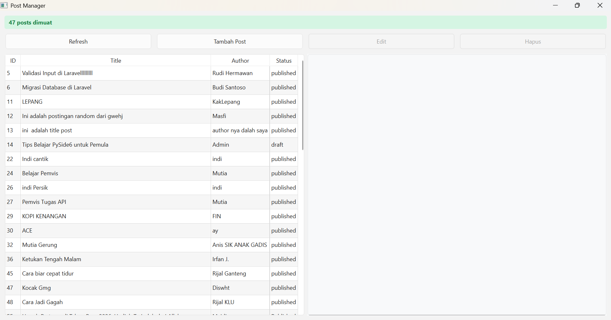
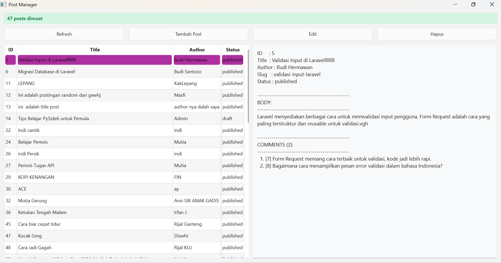
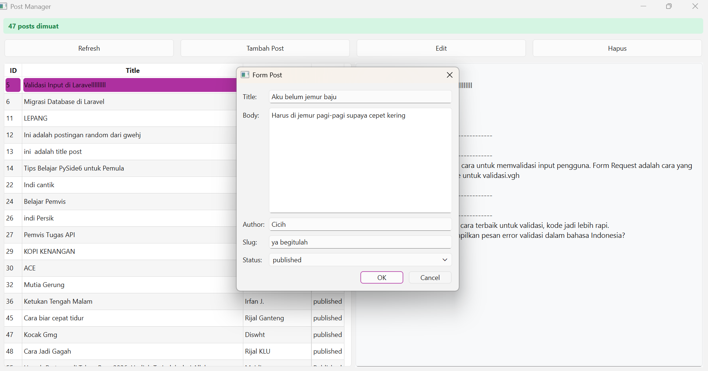
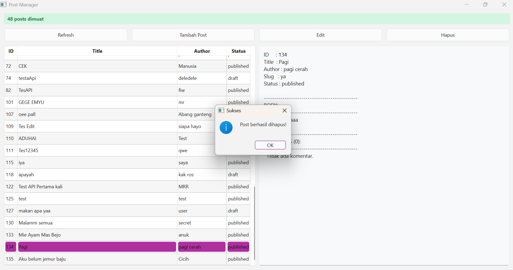
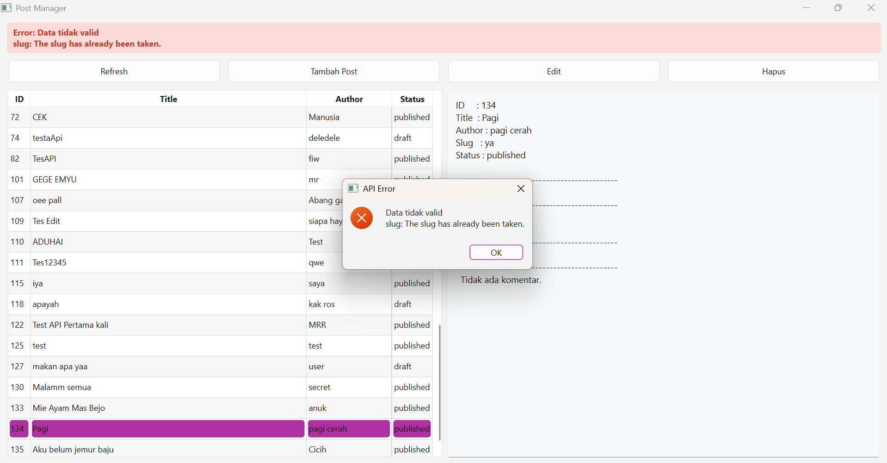
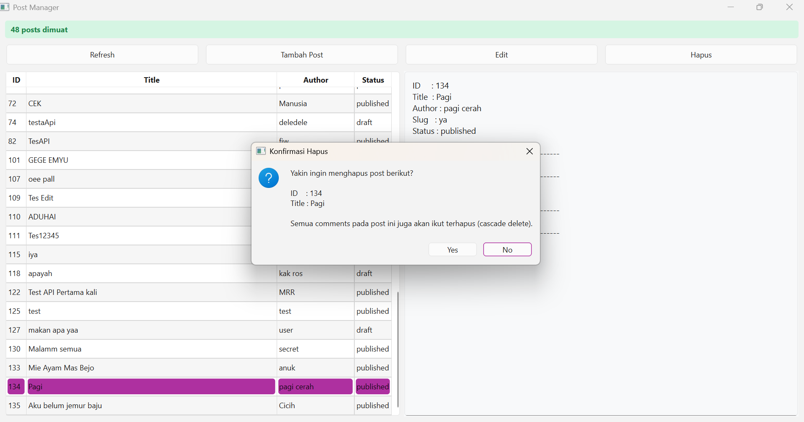

# T6-week11
# Tugas 5-Threading & REST API: Post Manager

Aplikasi desktop berbasis PySide6 untuk mengelola data Post menggunakan REST API nyata (https://api.pahrul.my.id/api/posts). Aplikasi ini mengimplementasikan operasi CRUD lengkap dengan pendekatan Multi-Threading (QThread + Worker Pattern) agar UI tetap responsif dan tidak freeze saat melakukan request ke server.

Aplikasi dibagi menjadi 4 file sesuai prinsip SoC agar kode rapi dan mudah dirawat:
1. api_service.py untuk layer data yang berisi logika HTTP request (GET, POST, PUT, DELETE).
2. api_worker.py untuk layer Threading yang berisi logika Worker (QThread) untuk menjalankan request di background.
3. dialogs.py untuk layer UI Component yang berisi form dialog untuk input data Post.
4. main.py untuk layer Window Utama yang menghubungkan semua komponen, mengatur state UI, dan entry point.

# Fitur yang di implementansikan pada kode-kode tersebut
1. Ada CRUD yaitu tambah, baca, update, hapus dan post via API
2. Data list ditampilkan di tabel, klik baris untuk lihat detail lengkap + comments di panel samping.
3. Ada indikator loading, pesan sukses (hijau), error (merah), dan empty (kuning).
4. Menangani timeout, connection error, dan validasi server (Error 422 untuk slug unik).
5. ombol Edit dan Hapus hanya aktif jika ada baris tabel yang dipilih. Hapus post memiliki dialog konfirmasi cascade delete.

# Cara menjalankannya
Jalankan file utamanya yaitu main.py dengan ketik python main.py pada terminal

# Hasil Screenshot Aplikasi
1. Tampilan Daftar Post
    Pada tampilan awal terdapat tabel yang menampilkan data ID, Title, Author, dan Status. Statu bar hijau menandakan data berhasil di muat.
    
2. Detail Post dan Comments
    Jika klik salah satu baris, panel kanan menampilkan detail lengkap termasuk body dan daftar comments dengan animasi loading.
    
3. Form Tambah Post
    Jika klik tombol Tambah Post, muncul dialog form isian Title, Body, Author, Slug, dan Status Form Tambah
    
4. Sukses Menambahkan Post
    Terdapat popup konfirmasi sukses yang menampilkan ID baru yang dikembalikan oleh server
    
5. Error Handling Validasi 422 
    Ketika mencoba menyimpan slug yang sudah ada, muncul pesan error dari server yang ditangkap dengan baik oleh aplikasi
    
6. Konfirmasi Hapus Post (Cascade Delete)
    Saat menghapus, muncul dialog peringatan bahwa comments juga akan ikut terhapus
    

